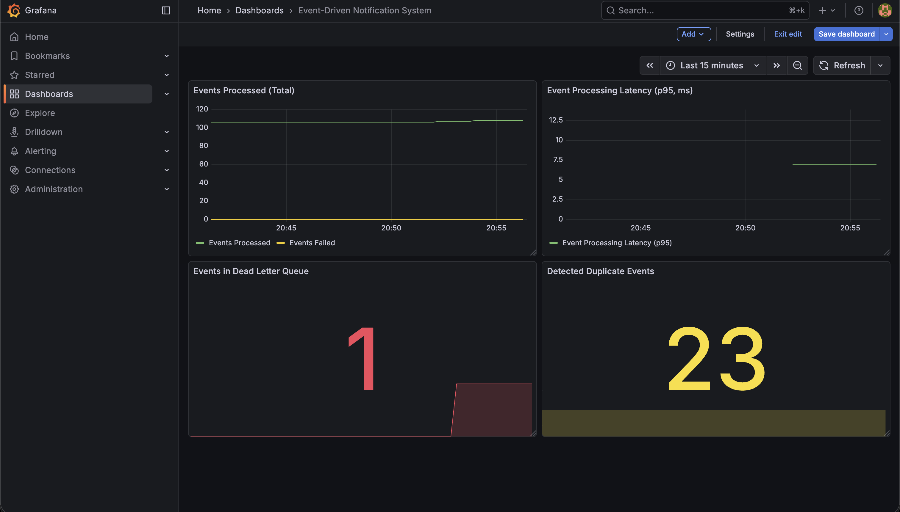
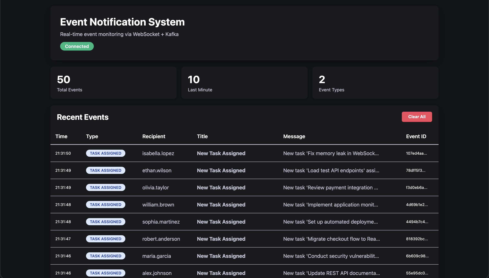

# Event-Driven Notification System

Event driven notification system created with Spring Boot, Kafka, Docker, and PostgreSQL.

---



---

## Core Functionality
- **Event-driven architecture** with Apache Kafka
- **Exactly-once delivery** through idempotent producer and transactional processing
- **Dead Letter Queue** with exponential backoff retry
- **Production monitoring**: Prometheus metrics + Grafana dashboards tracking
- **Real-time WebSocket notifications** (broadcast + user-specific)
- **Polymorphic event payloads** with Strategy Pattern
- **Live demo UI** with real-time updates and persistent event history

---

- ## Architecture
````mermaid
flowchart TB
    subgraph Client["<b>CLIENT LAYER</b>"]
        UI["Live Demo UI<br/>(http://localhost:8080/)"]
        API["REST Client<br/>(curl / Postman)"]
    end
    
    subgraph Spring["<b>SPRING BOOT</b>"]
        direction TB
        
        subgraph API_Layer["API Layer"]
            Controller["EventController<br/>POST /api/events<br/>GET /api/events/recent"]
        end
        
        subgraph Business["Business Logic"]
            EventAppService["EventApplicationService<br/>- Idempotency Check<br/>"]
            EventHandler["EventHandler<br/>- Duplicate check<br/>- Notification Trigger"]
            EventPerService["EventPersistenceService"]
            NotifAppService["NotificationApplicationService"]
            NotifDisService["NotificationDispatcher<br/>- Message Builder<br/>"]
        end
        
        subgraph Integration["Integration Layer"]
            Producer["Kafka Producer"]
            Consumer["Kafka Consumer<br/>- Retry Logic (3x)<br/>- Exponential Backoff"]
            WSChannel["WebSocketNotificationChannel<br/>- Broadcast<br/>- User-specific"]
        end
    end
    
    subgraph Infrastructure["<b>INFRASTRUCTURE</b>"]
        Kafka[("Apache Kafka<br/><b>Topic: events</b><br/>")]
        DLQ[("Apache Kafka Dead Letter Queue<br/><b>Topic: events-dlt</b><br/>")]
        DB[("PostgreSQL<br/><b>events table</b><br/>")]
        Prom[("PrometheusMetrics Storage")]
        Graf[("GrafanaDashboards")]
    end
    
    %% Main Flow
    API -->|"POST /api/events<br/>"| Controller
    Controller -->|"Process"| EventAppService
    EventAppService -.->|"Check if exists"| DB
    EventAppService -->|"Publish event"| Producer
    Producer -->|"Send event"| Kafka
    
    Kafka -->|"Consume event"| Consumer
    Consumer -->|"Process"| EventHandler
    
    EventHandler -->|"Process"| EventPerService
    EventPerService --> |"Persist"| DB
    EventHandler -->|"Notify"| NotifAppService
    
    NotifAppService --> |"Process"| NotifDisService
    NotifDisService -->|"Process"| WSChannel
    
    %% WebSocket back to UI
    WSChannel -.->|"Real-time push"| UI
    
    %% Load history
    UI -->|"GET /api/events/recent"| Controller
    Controller -->|"Query 50 recent"| DB
    
    %% DLQ Flow
    Consumer -.->|"Failed 3x<br/>(1s, 2s, 4s)"| DLQ

    %% Monitoring
    Spring -.->|"Expose metrics"| Prom
    Prom -.->|"Query data"| Graf
    
    %% Styling
    classDef clientStyle fill:#e3f2fd,stroke:#1976d2,stroke-width:3px,color:#000
    classDef springStyle fill:#f3e5f5,stroke:#7b1fa2,stroke-width:3px,color:#000
    classDef kafkaStyle fill:#fff3e0,stroke:#f57c00,stroke-width:3px,color:#000
    classDef dbStyle fill:#e8f5e9,stroke:#388e3c,stroke-width:3px,color:#000
    classDef dlqStyle fill:#ffebee,stroke:#d32f2f,stroke-width:3px,color:#000
    classDef wsStyle fill:#fce4ec,stroke:#c2185b,stroke-width:3px,color:#000
    classDef monitorStyle fill:#fff9c4,stroke:#f57f17,stroke-width:3px,color:#000
    
    class UI,API clientStyle
    class Controller,EventAppService,EventHandler,EventPerService,NotifAppService,NotifDisService,Producer,Consumer springStyle
    class Kafka kafkaStyle
    class DB dbStyle
    class DLQ dlqStyle
    class WSChannel wsStyle
    class Prom,Graf monitorStyle
````

---

## Event Flow Explained

1. **Client** sends POST request with event data + optional `idempotencyKey`
2. **EventApplicationService** checks if event already exists (idempotency check)
3. **Kafka Producer** publishes to `events` topic
4. **Kafka Consumer** receives event and attempts processing. **If processing fails** → automatic retry with exponential backoff (3 attempts: 1s → 2s → 4s)
6. **If all retries exhausted** → event moves to Dead Letter Queue for investigation
7. **On success**: EventHandler coordinates two atomic actions:
   - Persists event to PostgreSQL
   - Triggers notification pipeline
8. **NotificationDispatcher** uses Strategy Pattern to select appropriate builder and format message
9. **WebSocket** sends real-time notification to connected clients (broadcast or user-specific)
   
---



---

## Tech Stack
- Java 21
- Spring Boot 4.0.2
- Apache Kafka 3.7.0
- PostgreSQL 16
- Docker Compose
- Prometheus
- Grafana
- Adminer

---

## Quick Start
```bash
# 1. Start infrastructure
docker-compose up -d

# 2. Run application
mvn spring-boot:run

# 3. Open demo UI
open http://localhost:8080

#4. Send test event
curl -X POST http://localhost:8080/api/events \
  -H "Content-Type: application/json" \
  -d '{
    "type": "TASK_ASSIGNED",
    "recipientId": "user-123",
    "idempotencyKey": "8f4b3c2e-6d2a-4a1f-9e12-123456789hwq",
    "payload": {
      "payloadType": "TASK_ASSIGNED",
      "taskName": "Prepare quarterly report",
      "taskDescription": "Compile financial data and prepare Q1 report",
      "assignedBy": "manager-456",
      "dueDate": "2026-03-01"
    }
  }'
  
Watch it appear in real-time at http://localhost:8080
```

---

## Monitoring

- **Demo UI**: http://localhost:8080
- **Adminer (DB)**: http://localhost:8083
- **Prometheus**: http://localhost:9090
- **Grafana**: http://localhost:3000
- **Kafka topics**: 
```bash
  docker exec -it edns-backend-kafka-1 /opt/kafka/bin/kafka-topics.sh \
    --bootstrap-server localhost:9092 --list
```

---

## License

MIT
